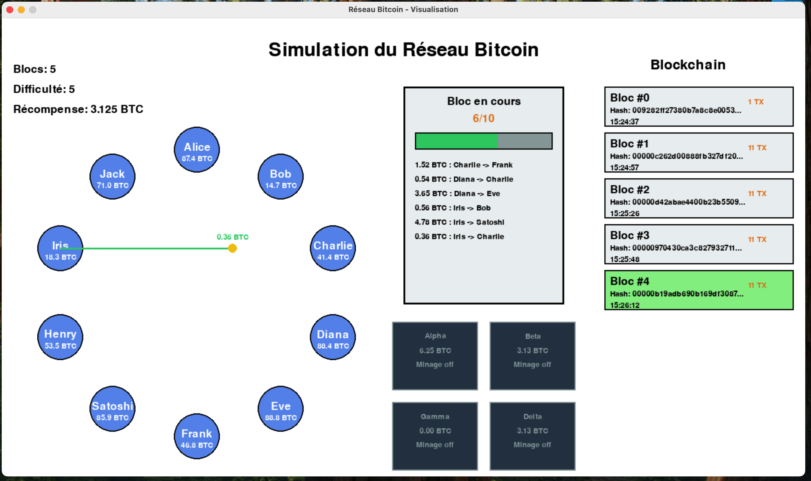

# Simulation du Réseau Bitcoin

Ce projet propose une implémentation du réseau Bitcoin. Une interface visuelle est aussi disponible en exécutant le code "interface_gemini.py". On explique dans ce texte le fonctionnement de la blockchain utilisée par le réseau Bitcoin et par les autres cryptomonnaies.

## Sécurisation des transactions

### **1. Signature numérique**

Pour sécuriser les transactions, la blockchain Bitcoin utilise un système de cryptographie asymétrique permettant de démontrer que l’on connaît un secret sans avoir à le dévoiler. Elle est basée sur un système à clé privée et publique. Celle-ci permet de vérifier des transactions pair à pair de manière décentralisé, donc sans entitée unique controlant toutes les transactions (comme Visa ou Mastercard). 

Chaque utilisateur possède :
* **une clé privée** : un nombre aléatoire secret,
* **une clé publique** : dérivée de la clé privée.

Lorsqu’un utilisateur A envoie 3 BTC à un utilisateur B, on peut encoder cette transaction sous la forme du **Message** suivant : "clé publique A -> 3 -> clé publique B".

1. L'utilisateur A signe la transaction avec sa clé privée. Seul lui peut générer cette _Signature_ car il est le seul à connaitre sa clé privée.  
&nbsp;→ Sign(**Message**, clé privée A) = _Signature_

2. N’importe qui peut vérifier la signature d'une personne avec le message qu'elle a signé et sa clé publique.  
&nbsp;→ Verify(**Message**, _Signature_, clé publique A) = True/False

Les deux fonctions Sign et Verify sont présentes dans la classe Utilisateur du code. Cela permet de confirmer l’authenticité de la transaction à partir de la clé publique de A et donc sans révéler sa clé privée. Ce mécanisme repose sur ECDSA (Elliptic Curve Digital Signature Algorithm).

### **2. Génération de la clé publique**

La clé publique (K) est calculée à partir de la clé privée (k) : K = k × G

avec :

* k = clé privée (entier),
* G = point générateur de la courbe,
* × = multiplication de point sur la courbe elliptique.

Bitcoin utilise la courbe elliptique secp256k1, définie par : y^2 = x^3 + 7 mod p
où p est un nombre premier très grand : 2^256 − 2^32 − 977 

Retrouver la clé privée (k) à partir de la clé publique (K) est équivalent à résoudre le problème du logarithme discret elliptique, réputé incalculable (dans des temps humainement raisonables) avec les moyens informatiques actuels. C’est ce qui rend la clé privée impossible à deviner et protège la sécurité des transactions.

## Sécurisation de la Blockchain

### **1. Principe du Proof of Work**

Une fois les transactions signées, donc authentifiées, par les utilisateurs, elles sont envoyées au réseau Bitcoin. Celui-ci est sécurisé par un mécanisme de consensus appelé preuve de travail (Proof of work).
Des milliers de serveurs, appelés mineurs, reçoivent ces transactions, les assemblent sous forme de bloc (une liste d'environ 3000 transactions) et tentent de valider ce bloc en résolvant un problème cryptographique : trouver un hash suffisamment petit. 

Une fonction de hachage prend une entrée un texte de taille arbitraire et produit une sortie de taille fixe (appelée hash). Cette sortie est déterministe (même entée = même sortie) et non reversible : il est impossible en pratique de retrouver l'entrée à partir de la sortie. La fonction de hachage utilisée par Bitcoin est appelée SHA256.

Exemple : SHA256("Bonjour") = b1e0b5d7f6a7bfc7c16e8b1443c72e6b6a2

### **2. Structure d’un bloc**

Un bloc contient notamment :
* le hash du bloc précédent H(n-1),
* une liste de transactions (incluant la récompense du mineur),
* une racine de Merkle (résumé cryptographique des transactions),
* un champ bits (difficulté encodée),
* un timestamp,
* un nonce.

Ces informations sont condensées dans un résumé, appelé header du bloc, qui a la forme suivante : "version | hash_bloc_précédent | racine_Merkle |  timestamp | bits | nonce". 

### **3. Rôle des mineurs**

Les mineurs font varier un nombre, le nonce, présent dans le header puis calculent le hash du header pour qu'il respecte la cible de difficulté. La fonction SHA256 est utilisée deux fois pour plus de sécurité.

La condition à satisfaire est : SHA256(SHA256(header du bloc)) < cible

Ils répètent donc :  
while True:  
&nbsp;hash_val = SHA256(SHA256(header + nonce))  
&nbsp;if hash_val < cible:  
&nbsp;&nbsp;break  
&nbsp;else:  
&nbsp;&nbsp;nonce += 1  

Exemple : cible = 0000FFFFFFFFFFFFFFFFFFFFFFFFFFFF 
Il faut trouver un hash commençant par au moins quatre zéros (qu'importe les digits suivants). Les mineurs vont tester un grand nombre de valeurs du nonce jusqu'à ce qu'ils trouve celui qui permet d'atteindre le nombre de zéros du hash désiré. Trouver un tel hash est purement probabiliste : chaque essai a une probabilité de réussite d’environ 1 / 2^(nombre_de_zéros). Donc plus le nombre de zéros est grand, plus il faut d’essais. Le protocole Bitcoin ajuste la difficulté tous les 2016 blocs (environ toutes les deux semaines) pour maintenir un rythme d’un bloc toutes les 10 minutes en moyenne.

### **4. Validation et récompense**

Lorsqu’un mineur trouve un bloc valide, il le diffuse au réseau. Il est ensuite facile pour les autres mineurs de vérifier que ce nonce est correct, et que donc ce bloc a été validé.

Le mineur reçoit alors :
* la **récompense de bloc** (3,125 BTC depuis le halving de 2024),
* les **frais de transaction** inclus dans ce bloc (de l'ordre de 0.00001 BTC).

### **5. Comment cela garantit la sécurité**

Le Proof of Work rend les attaques énergétiquement coûteuses. Voyons deux exemples : une tentative de falsification d'un bloc déjà inscrit dans la Blockchain et du dernier bloc en cours de minage. Tout d'abord, il n'est pas possible d'enregistrer une transaction d'un utilisateur X vers soi, car il faudrait sa clé privée pour signer la transaction. Il est cependant possible de modifier une transaction faite par soi-meme vers quelqu'un d'autre. Par exemple, j'ai acheté une moto pour 2 BTC, puis je modifie cette transaction après pour n'avoir envoyé que 1 BTC.

#### Tentative de modification d'un bloc déjà validé

Si un attaquant veut modifier un bloc déjà inscrit dans la Blockchain :
&nbsp;Il change une transaction → change le hash du bloc.
&nbsp;Donc le lien avec le bloc suivant devient invalide car il contient le hash du bloc précédent.
&nbsp;Il doit recalculer les hashs de tous les blocs suivants pour rattraper la chaîne honnête.

Mais pendant ce temps, le reste du réseau continue d’avancer. Modifier un bloc impliquerait de refaire tout ce calcul pour ce bloc et tous les suivants. Les mineurs suivent toujours la chaîne avec le plus de travail accumulé (total difficulty), donc la chaîne la plus longue. L’attaquant devrait donc disposer de > 50% de la puissance de calcul totale pour espérer rattraper et dépasser la chaîne valide, c’est la fameuse attaque des 51%, en pratique impossible à mener à grande échelle.

#### Tentative de modification du dernier bloc

Il n'est donc pas possible de modifier un bloc au milieu de la Blockchain. Mais si le mineur frauduleux essaie de modifier le bloc actuel en cours de minage (le dernier bloc de la Blockchain, validé toutes les 10min) et qu'il arrive à trouver un hash valide avant les autres mineurs, est ce qu'il peut l'envoyer aux autres mineurs pour qu'il soit accepté ? 

Non, car tous les mineurs ont accès au même ensemble public de transactions valides (mempool), le mineur frauduleux ne peut donc pas inventer une transaction car le bloc ne serait pas accepté par les autres mineurs. Quand ils recoivent un nouveau bloc, en plus de vérifier son hash, ils vérifient que les transactions correspondent à celles présentes dans le mempool. Les transactions sont validées après avoir vérifié leurs signatures, que les utilisateurs possèdent assez de BTC pour faire la transaction ou qu'il ne font pas de double dépense. Il peut cependant choisir les transactions (ex : faire passer celles avec les plus gros frais), ordonner les transactions ou censurer une transaction (ne pas l’inclure).

## Conclusion

Vous avez maintenant compris comment la Blockchain sécurise les transactions du réseau Bitcoin. Les signatures permettant d'authentifier les transactions et le travail des mineurs vient sécuriser et rendre immuable le registre de ces transactions. La blockchain peut donc servir à authentifier n'importe quelle information, elle est aussi utilisée par les NFT, les RWA (Real World Asset), pour certifier son diplome par son école ou par tout autre système souhaitant avoir des informations vérifiables.

Voici une capture d'écran de l'interface illustrant ce fonctionnement :

